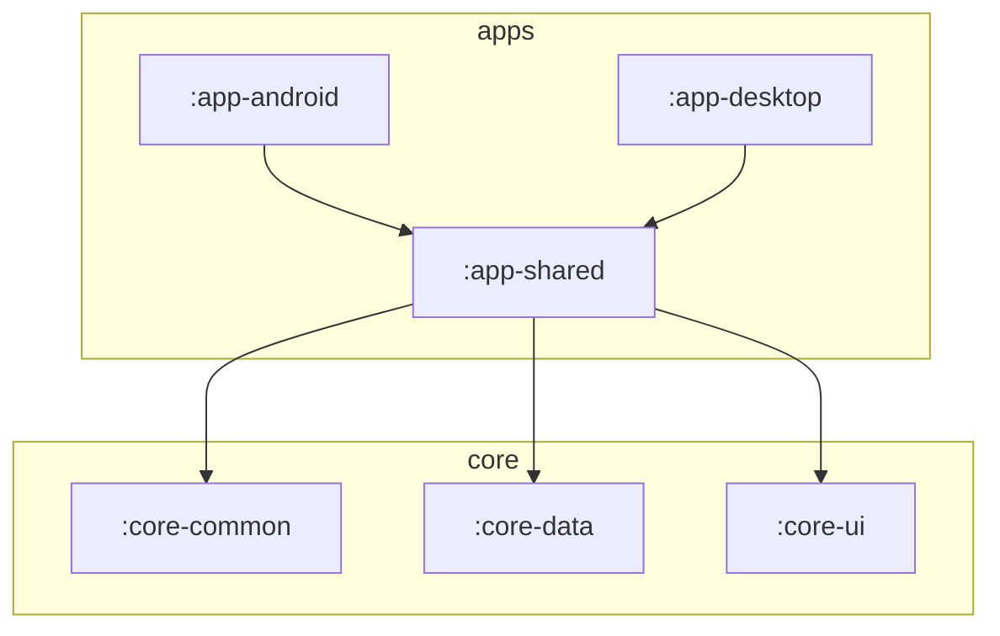

# Artes
Skillful Helpers - A Kotlin library for generalizing interaction with AI services.

Related: https://github.com/Pointyware/AI-Licensing

## Features
* Model Training
    * AI Architecture
    * Training Paradigm
    * Data Selection
    * Epochs/History
    * Fine-tuning
* Trained Model Libraries
    * Open models - publicly trained models with all information known
    * Closed models - some or all information may be unstated and/or unverified; may be complete models for local hosting or APIs that remotely host models
* Local and Remote execution support - models that are available for user-execution (local hosting) can also be hosted remotely if a user does not have enough local resources. This distinction will be transparent to the user, withholding network-delayed query speeds.
* Cost estimation and logging - the cost of a query can often be estimated before sending a request; if a request is served by an API, the cost is often returned in the response body or headers.
* Supports MCP https://modelcontextprotocol.io/introduction https://www.anthropic.com/news/model-context-protocol 

### Services
1. OpenAI
2. Hugging Face
3. Stability AI
4. Anthropic

#### [OpenAI](https://openai.com/about)
The closed-source company that first started the most recent AI-boom with their release of GPT-4. Has the widest range of functionality I know of for a service provided by a single entity.

#### [Hugging Face](https://huggingface.co/huggingface)
The open-source first website that has enabled significant leaps and bounds to be made by the open source community. Easily has the widest range of functionality of any service whatsoever thanks to the dedication and passion of said open-source community.

#### [Stability AI](https://stability.ai/about)
Came to prominence thanks to their release of the image generation arch/model Stable Diffusion.

#### [Anthropic](https://www.anthropic.com/company)
Considered to be an ethical leader by some. Founded by former employees of OpenAI because of disagreements over the direction of the company.

## Domain Artes

I'm drawn to the domains of life as an analogy for classifying different artificial intelligences. Some will be immediately repulsed by this idea (even as an analogy) but I would point out that the highest clades correspond to the earliest forms of life that many would hardly recognize as life – let alone intelligent.

Intelligence is an emergent trait, and I have no problem setting "Artes" as the kingdom and root for all human artifices used as tools for ever broadening purposes and increasing complexity. Innovations build on prior, existing mechanisms, resulting in incremental changes to functionality that present advantages or disadvantages across differing environments. I see this as a sort of midpoint between biological evolution and the analogous meme theory: mechanical evolution.

If you find yourself wanting to point out that mechanical evolution allows the permutation and mixing of innovations across lineages while biological evolution does not, then you need to read a bit more.

## Project Structure

