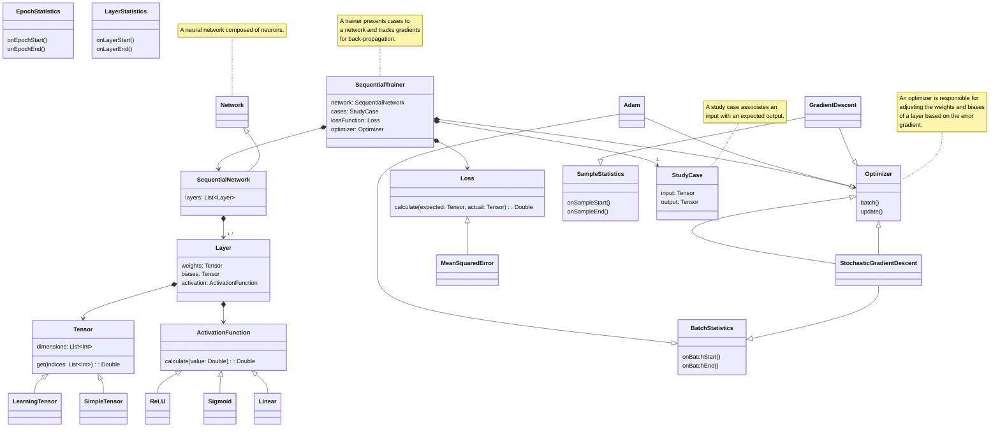
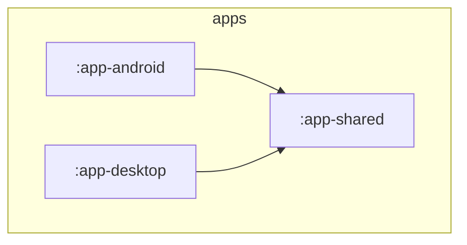

# Ember
This project started as a small attempt to recreate some machine learning primitives from 
scratch in Kotlin.
I quickly realized while doing research that I could fairly easily build a small set of primitives
to build larger components and scale up complexity rapidly. At the same time that I was
learning about different optimization and visualization techniques for my own use, I realized
they would make fantastic learning tools for others as well.

Related: https://github.com/Pointyware/AI-Licensing

## Features
This content was migrated from the `:scratch` module and most will likely be moved 
to `:core-entities`.

- Tensors
- Activation Functions
    - ReLU
    - Sigmoid
    - Tanh
- Layers
    - Linear (Fully Connected)
    - Exp: Convolutional
- Networks
    - Sequential Networks
- Loss Functions
    - Mean Squared Error
    - Cross Entropy
- Optimizers
    - Stochastic (Gradient Descent)
    - Exp: Adam
- Training
    - Sequential Trainer
    - Exp: Organic Trainer

## Project Structure

