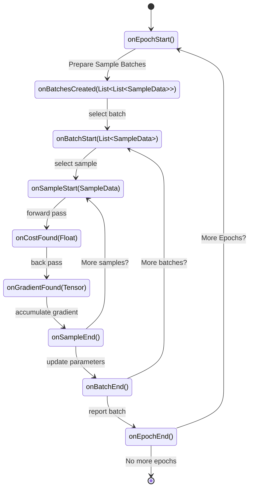

# Module Feature Training
This module provides the Training feature of the Ember application.
It includes functionality for training models, managing training data, 
and monitoring training progress.

## Trainer Workflow
A trainer is initialized with everything it needs to complete training epochs. For each training period, a trainer follows the same general workflow: for each epoch, sample batches are created; for each batch, the network is evaluated for each sample, with gradients averaged across the batch.

