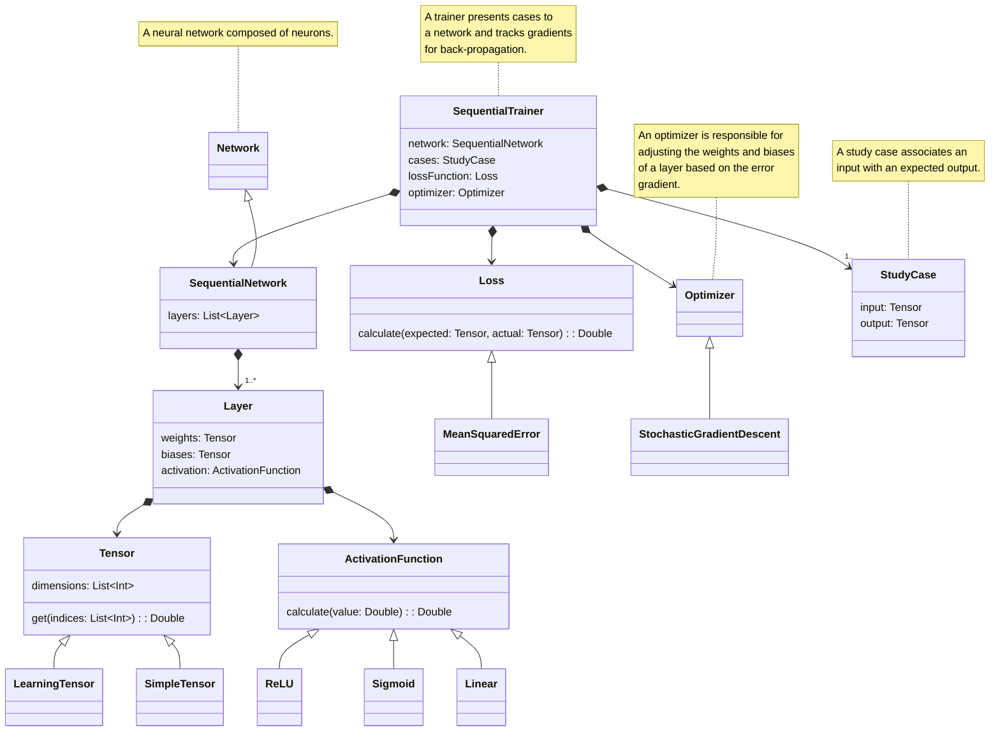

# Module :scratch
This module is a small attempt to recreate some machine learning primitives from scratch in Kotlin.

## Features
- Tensors
- Activation Functions
  - ReLU
  - Sigmoid
  - Tanh
- Layers
  - Linear (Fully Connected)
  - Exp: Convolutional
- Networks
  - Sequential Networks
- Loss Functions
  - Mean Squared Error
  - Cross Entropy
- Optimizers
  - Gradient Descent
    - Stochastic
- Training
  - Sequential Trainer
  - Exp: Organic Trainer

